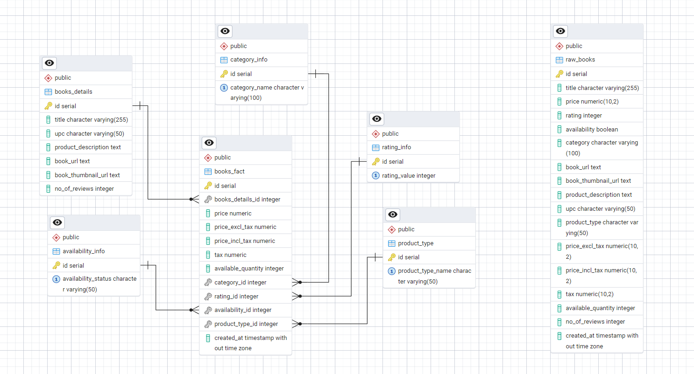

# Books ETL Pipeline with Data Warehousing

This repository contains an end-to-end data pipeline that extracts, transforms, and loads (ETL) book listing data from [Books to Scrape](http://books.toscrape.com/) into a PostgreSQL database (localhost). It then models the data for analytical purposes using a **star schema** data warehouse design.

---

## Overview

The solution is divided into two main parts:

1. **ETL Pipeline:**  
   - **Extraction:** Scrapes the book listings site and retrieves detailed book information by visiting each book's detail page.
   - **Transformation:** Cleans and standardizes the raw data. Data quality is ensured by handling missing values, duplicates, inconsistent formats (e.g., encoding issues in prices), and performing consistency validations on pricing fields.
   - **Loading:** Loads the transformed data into a staging table named `raw_books` in PostgreSQL.

2. **Data Warehouse (Star Schema):**  
   - The data from the `raw_books` staging table is then loaded into a star schema data warehouse.
   - **Dimension Tables:**  
     - `books_details` – Stores detailed book descriptive data (title, UPC, product description, URLs, number of reviews).
     - `category_info` – Contains unique book categories.
     - `rating_info` – Stores rating information as numeric values.
     - `availability_info` – Holds the availability status (e.g., "In Stock" or "Out of Stock").
     - `product_type` – Contains the product type information.
   - **Fact Table:**  
     - `books_fact` is the central table that stores transactional measures (e.g., price, tax, available quantity) and references each of the dimension tables directly.

---

## ERD

Below is an ERD diagram for the star schema design. (Please see the `ERD-Star-Schema-Data-Warehouse.png` file in this repository.)



---

## Architecture Details

### Staging Table: `raw_books`

All raw, transformed book data is loaded into the `raw_books` table, which serves as a staging area for the ETL process.

### Dimension Tables

- **`books_details`**  
  Holds descriptive book information such as title, UPC, product description, book URL, thumbnail URL, and number of reviews.

- **`category_info`**  
  Stores unique book categories.

- **`rating_info`**  
  Contains rating values (e.g., 1-5).

- **`availability_info`**  
  Stores stock status values such as "In Stock" and "Out of Stock".

- **`product_type`**  
  Contains the types of products (e.g., "Books").

### Fact Table: `books_fact`

The fact table holds numerical measures and foreign keys referencing the dimension tables:
- **Measures:** `price`, `price_excl_tax`, `price_incl_tax`, `tax`, `available_quantity`
- **Foreign Keys:** References to `books_details`, `category_info`, `rating_info`, `availability_info`, and `product_type`.

This design ensures all dimensions are directly accessible from the fact table, a key characteristic of a star schema, which simplifies and optimizes analytical queries.

---

## How to Run

1. **Prerequisites:**
   - Python 3.x
   - PostgreSQL installed and running on localhost.
   - Required Python packages:
     ```bash
     pip install requests beautifulsoup4 pandas psycopg2-binary python-dotenv
     ```

2. **Environment Variables:**
   Create a `.env` file in the project root with the following content (adjust values as needed):
   ```env
   HOST=localhost
   DATABASE=your_db_name
   USER=your_username
   PASSWORD=your_password

3. **Execution: Run the script using:**
   ```bash
   python main.py
   ```
   The script will:
   - Scrape data from Books to Scrape.
   - Transform and load data into the raw_books staging table.
   - Build and populate the star schema data warehouse.

---

## Approach & Considerations

1. **Data Quality:**
   - The pipeline handles missing values by using category-wise averages for prices.
   - Sets default values where necessary (e.g., defaulting missing product types to "Books").
   - Duplicates are removed.
   - Data is validated to ensure consistency across pricing fields.

2. **Modularity & Efficiency:**
   - The code is structured into modular functions for extraction, transformation, and loading, making it maintainable and extendable.
   - Logging is implemented throughout the process to facilitate debugging and monitoring.

3. **Data Warehouse Design:**
   - A star schema was chosen for its simplicity and efficiency in analytical querying.
   - The fact table directly references each dimension, ensuring optimized query performance for business intelligence and reporting.
  
4. **Documentation:**
   - This README provides a comprehensive guide to setting up, running, and understanding the ETL pipeline and data warehouse architecture.
